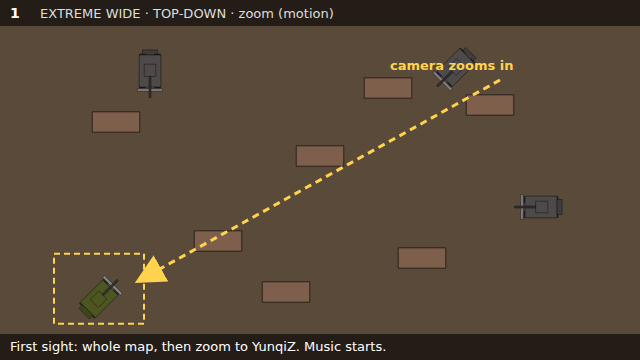
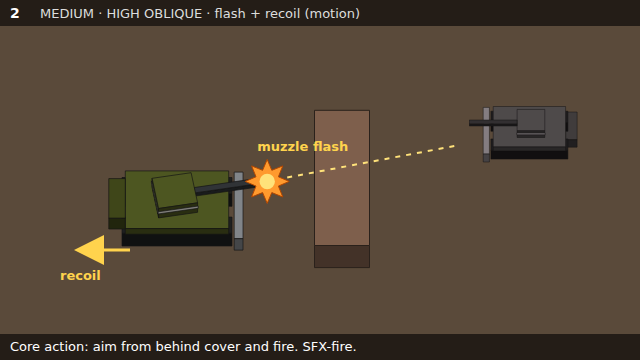
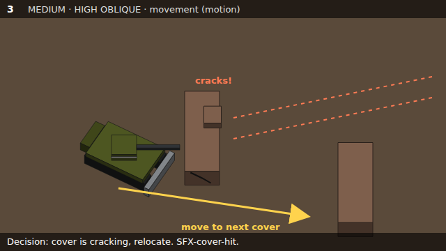
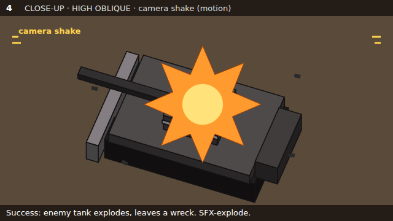
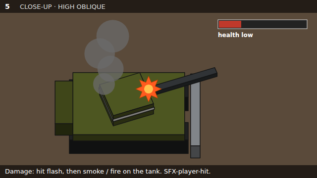
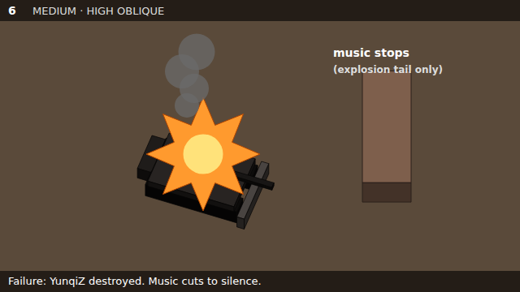
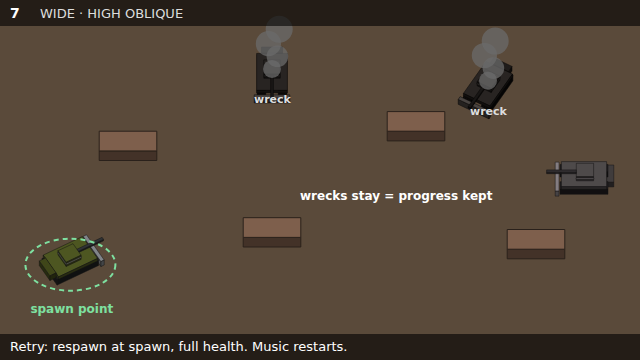
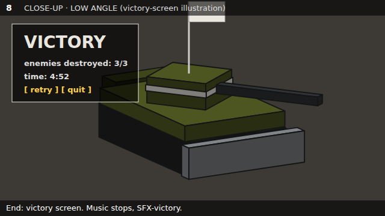

# STORYBOARD — walker-TANK

Eight panels, in play order. All panels use a **16:9** frame. During play the camera is a fixed oblique top-down view; the opening and the victory screen use special angles.

**Coverage across the board**

- Shot sizes: extreme wide (1), wide (7), medium (2, 3, 6), close-up (4, 5, 8).
- Camera angles: straight top-down (1), high oblique (2–7), low angle (8).
- Motion marked: camera zoom (1), muzzle flash and recoil (2), tank movement (3), camera shake (4).

## Asset IDs used in this storyboard

| ID | Asset |
|---|---|
| `CHAR-idle`, `CHAR-move`, `CHAR-recoil` | YunqiZ base hull and turret sprites (8 directions) |
| `FX-muzzle`, `FX-hit`, `FX-smoke`, `FX-burn` | Overlay effects on YunqiZ |
| `CHAR-destroyed`, `CHAR-victory` | One-direction poses |
| `ENEMY-tank`, `ENEMY-wreck` | Enemy tank and its wreck |
| `ENV-ground` | Mud and broken-brick ground |
| `ENV-cover` | Destructible cover, three stages: intact, cracked, broken |
| `FX-explosion` | Explosion effect |
| `SFX-fire`, `SFX-cover-hit`, `SFX-explode`, `SFX-player-hit`, `SFX-victory` | Sound effects |
| `MUS-battle-loop` | Music loop |
| `UI-health`, `UI-victory` | Health bar and victory screen |

---

## Panel 1 — First thing the player sees

- **Shot:** extreme wide · straight top-down · camera zooms in from the whole map to YunqiZ (motion).
- **Player does:** nothing yet; control starts when the zoom ends.
- **Player should see:** the whole battlefield: cover blocks, enemy tank positions, and YunqiZ at the spawn point with its white stripe.
- **Player should hear:** `MUS-battle-loop` starts; YunqiZ's engine idles.
- **Assets:** `ENV-ground`, `ENV-cover`, `ENEMY-tank`, `CHAR-idle`, `MUS-battle-loop`.
- **Why:** showing the whole map first lets the player plan a route between cover before the fight; the zoom hands the view over to gameplay.

## Panel 2 — Core action: fire from cover

- **Shot:** medium · high oblique · muzzle flash and recoil (motion).
- **Player does:** stays behind cover, aims the turret at an enemy, and fires.
- **Player should see:** the muzzle flash, the hull jolting back, the shell's path toward the enemy.
- **Player should hear:** `SFX-fire`, a deep, heavy cannon shot.
- **Assets:** `CHAR-idle`, `CHAR-recoil`, `FX-muzzle`, `ENV-cover`, `ENEMY-tank`, `SFX-fire`.
- **Why:** pillar *Every shot has weight*: the flash, recoil and sound together make each shot feel heavy.

## Panel 3 — Decision: cover is breaking

- **Shot:** medium · high oblique · YunqiZ moving to the next cover (motion).
- **Player does:** sees the cover crack under enemy fire and drives to another piece of cover.
- **Player should see:** the cover change from intact to cracked; the exposed gap while moving.
- **Player should hear:** `SFX-cover-hit` (stone and brick crumbling); the tracks rolling.
- **Assets:** `ENV-cover` (intact → cracked), `CHAR-move`, `ENEMY-tank`, `SFX-cover-hit`.
- **Why:** pillar *Cover is not permanent*: the visible cracking tells the player to move before the cover is gone.

## Panel 4 — Success: an enemy tank is destroyed

- **Shot:** close-up · high oblique · camera shake on impact (motion).
- **Player does:** lands the final hit on an enemy tank.
- **Player should see:** the explosion, then the enemy left as a dark wreck.
- **Player should hear:** `SFX-explode`.
- **Assets:** `ENEMY-tank`, `FX-explosion`, `ENEMY-wreck`, `SFX-explode`.
- **Why:** the success has to be clearer than any other moment, so it gets both a strong image and the shake.

## Panel 5 — Taking damage

- **Shot:** close-up · high oblique.
- **Player does:** gets hit while exposed.
- **Player should see:** the hit flash, then YunqiZ smoking (medium health) or burning (low health); the health bar drops.
- **Player should hear:** `SFX-player-hit`, a sharp metallic impact.
- **Assets:** `FX-hit`, `FX-smoke`, `FX-burn`, `UI-health`, `SFX-player-hit`.
- **Why:** pillar *Damage is information*: the player can read health from the tank itself, even muted.

## Panel 6 — Failure: YunqiZ is destroyed

- **Shot:** medium · high oblique.
- **Player does:** loses control as health reaches zero.
- **Player should see:** the explosion, then the wreck of YunqiZ.
- **Player should hear:** `SFX-explode`; the music stops, leaving only the explosion's fading tail.
- **Assets:** `FX-explosion`, `CHAR-destroyed`, `SFX-explode`, `MUS-battle-loop` (stops).
- **Why:** pillar *Cold steel battlefield*: the sudden silence makes the loss feel heavy instead of noisy.

## Panel 7 — Retry: respawn at the spawn point

- **Shot:** wide · high oblique.
- **Player does:** respawns at the spawn point and takes control again.
- **Player should see:** YunqiZ back at full health; the wrecks of enemies already destroyed are still on the map, and those enemies do not return.
- **Player should hear:** `MUS-battle-loop` restarts from the beginning; engine idle.
- **Assets:** `CHAR-idle`, `ENEMY-wreck`, `ENEMY-tank`, `ENV-cover`, `MUS-battle-loop`.
- **Why:** keeping the wrecks shows the player their progress was kept, so failure costs time, not everything.

## Panel 8 — End of the session: victory screen

- **Shot:** close-up · low angle (illustration on the victory screen).
- **Player does:** destroys the last enemy; the victory screen appears right away.
- **Player should see:** the victory screen with an illustration of YunqiZ, hatch open and flag raised, seen from a low angle.
- **Player should hear:** music stops; `SFX-victory`, a short, restrained victory sound.
- **Assets:** `UI-victory`, `CHAR-victory`, `SFX-victory`, `MUS-battle-loop` (stops).
- **Why:** a low angle makes the battered tank look strong at the moment it wins; a restrained sound keeps the grim mood.

---

## Authorship note

I chose the opening (top-down overview, then zoom to the tank), respawning at the spawn point with destroyed enemies staying gone, and going straight to a victory screen. Claude proposed the panel order and contents based on CONCEPT.md, the low-angle illustration on the victory screen, restarting the music on respawn, and the asset IDs. The panel sketches are rough code-drawn images made by Claude, not generative-model assets.

## Revisions after building the slice (appended)

- Panel 1 (top-down opening zoom) was not built; the slice starts in the gameplay view.
- Panel 8: the victory screen uses the right-facing YunqiZ sprite, not a low-angle illustration.
- Close-ups (panels 4, 5) are not separate camera shots; the slice keeps one camera and uses screen shake.
- Enemy tanks are YunqiZ tinted grey in code, not separate designs.
- Broken cover (panel 3) no longer blocks tanks or shells.
